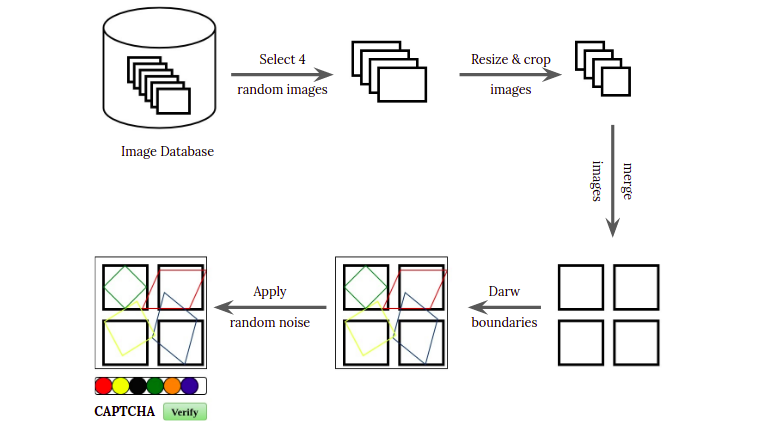
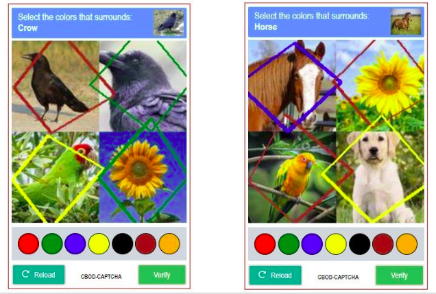

# CBOD-CAPTCHA (Color Boundary Object Detection-based CAPTCHA)

## Features and Novelty Points
---
> ### Comparatively Small Amount of Images 
> Generally, object recognition based CAPTCHA schemes have a massive number of images in the database. But this scheme didn't need a large number of images in the database. Because almost every step of this CAPTCHA generation technique is random. So, the probability of repeating the same query twice is negligible. As a result, it has a similar type of robustness found in large-scale image-based CAPTCHA mechanisms.  

 

> ### Difficult to Break by an AI Program 
> This approach is one step further than traditional object detection based CAPTCHA methods. Initial image preprocessing involved resizing and cropping, which removed some detail from the target object; made it more critical for AI to classify. The random boundary line and random noise made the image more robust. But these steps didn't affect human understandability.  

 

> ### Least Tedious for Human 
> The seven colors were used for boundary line coloring are the most common and eye-catchy colors. The target objects were the most familiar objects are found in the environment. The combination of two techniques made the CAPTCHA scheme quite a user-friendly one. It was proved from a small scale online survey conducted by the team.  

 

> ### A Novel Approach
> There is **no** existing CAPTCHA mechanism that exactly did the same.  

 

## Algorithm Flowchart
---

 
*Figure: Flowchat of CBOD-CAPTCHA generation technique*

 

## COBD-CAPTCHA Sample
---

 
*Figure: Sample of CBOD-CAPTCHA*

## Run with docker
> Install docker \
> run `docker compose up -d` to up and run the django app
